# ShellVibe

[](https://github.com/klc/shellvibe/actions/workflows/ci.yml)
[](https://shellvibe.dev)

> Cross-platform (iOS, Android, macOS, Windows, Linux) terminal, SSH/SFTP client and remote infrastructure workstation built with **Flutter 3.x / Dart 3.x**. Official website: [shellvibe.dev](https://shellvibe.dev).

ShellVibe brings modern, hardware-accelerated terminal rendering, a Zero-Knowledge encrypted identity vault, dual-pane SFTP, visual port-forwarding tunnels and multi-step runbook automation to **five platforms from a single codebase** — competing with Termius, Warp, Tabby, Blink Shell and MobaXterm.

## 📸 Screenshots

| Terminal — split panes | Hosts — with favourites |
| :--- | :--- |
| 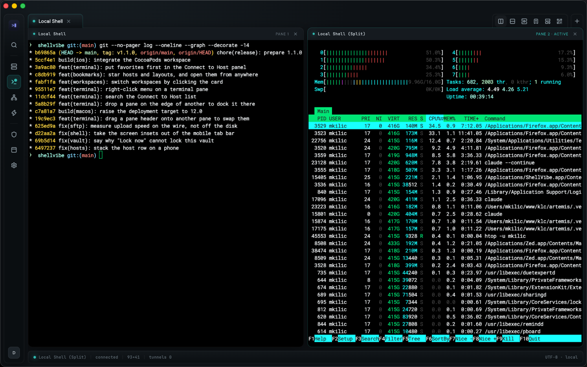 | 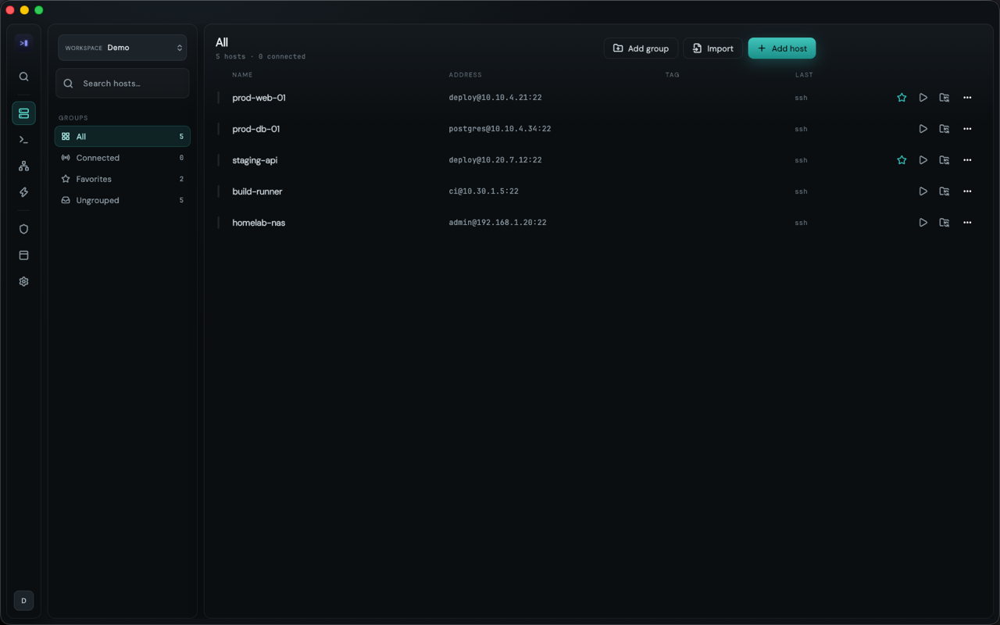 |

| Dual-pane SFTP | Command palette (⌘K) |
| :--- | :--- |
| 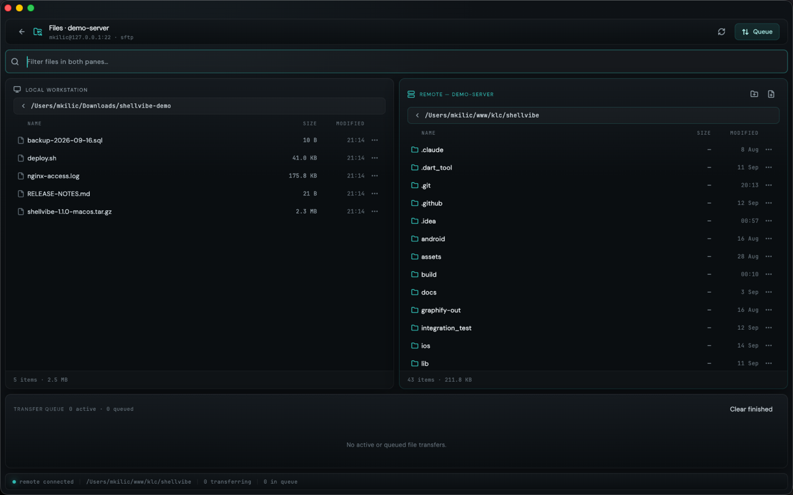 | 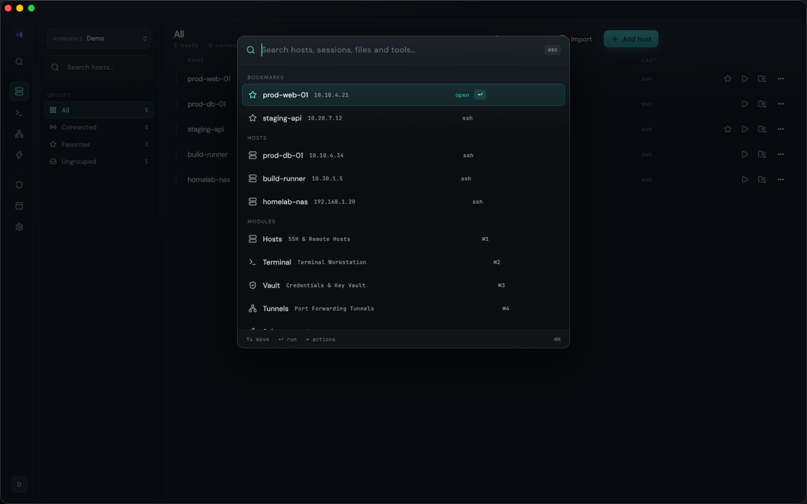 |

<details>
<summary>More screens — pane menu, tunnels, snippets, vault, AI access, settings, workspaces</summary>

**Right-click menu on a pane** — terminal actions and the tab bar's own split, template and transfer actions, aimed at the pane you clicked.

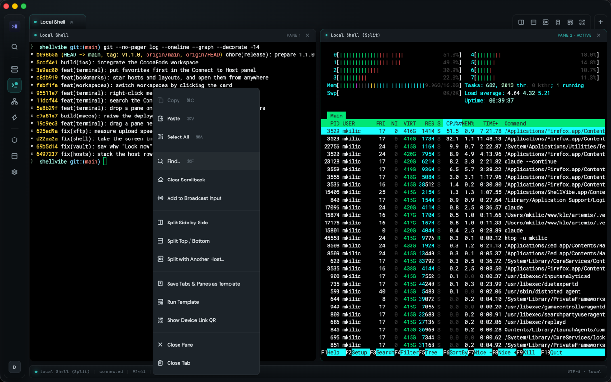

**Empty terminal screen** — a local shell, a saved server or a session handed over from your phone, with starred hosts as chips.

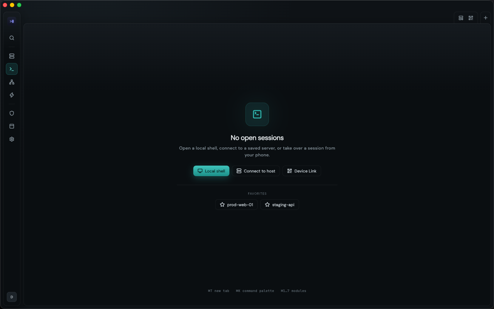

**Port-forwarding tunnels** — local, remote and dynamic SOCKS5 rules with live state.

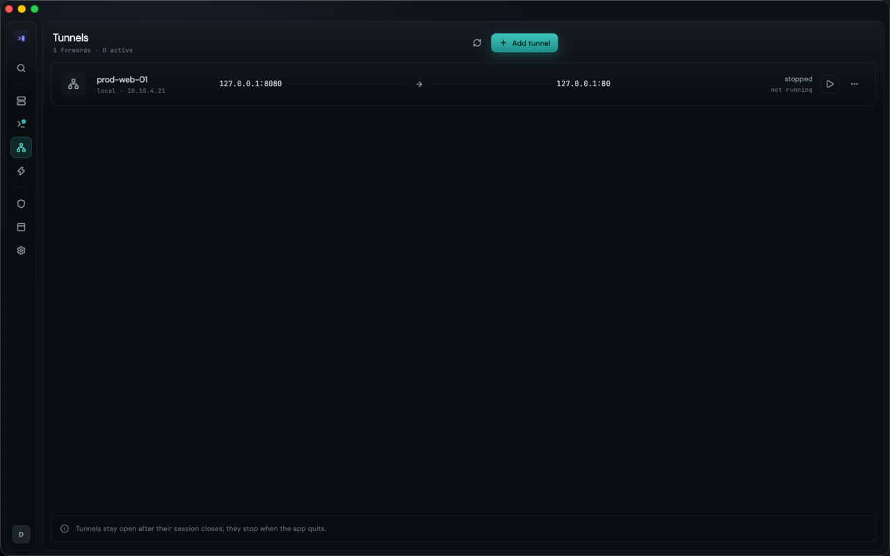

**Snippets** — parameterised commands (`${INPUT:name}`) reusable across every host in the workspace.

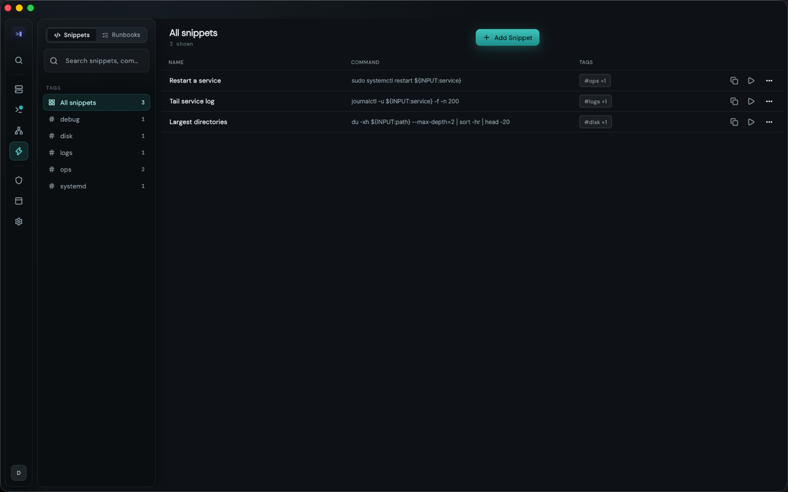

**Identity vault** — Argon2id + AES-256-GCM, master-password gated.

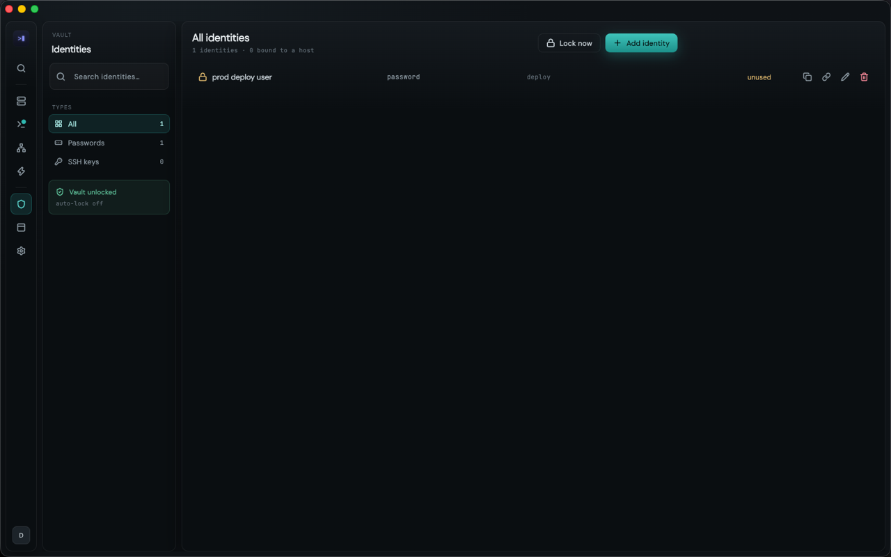

**AI access** — an MCP server, off by default, that lets an agent reach registered hosts under per-host approval, never with the credential itself.

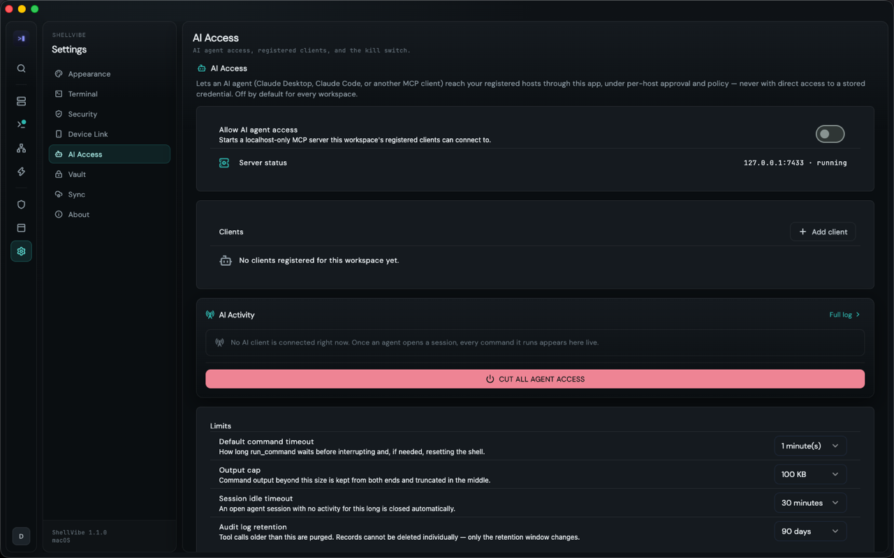

**Terminal settings** — palette, font, ligatures, cursor; applied to open sessions immediately.

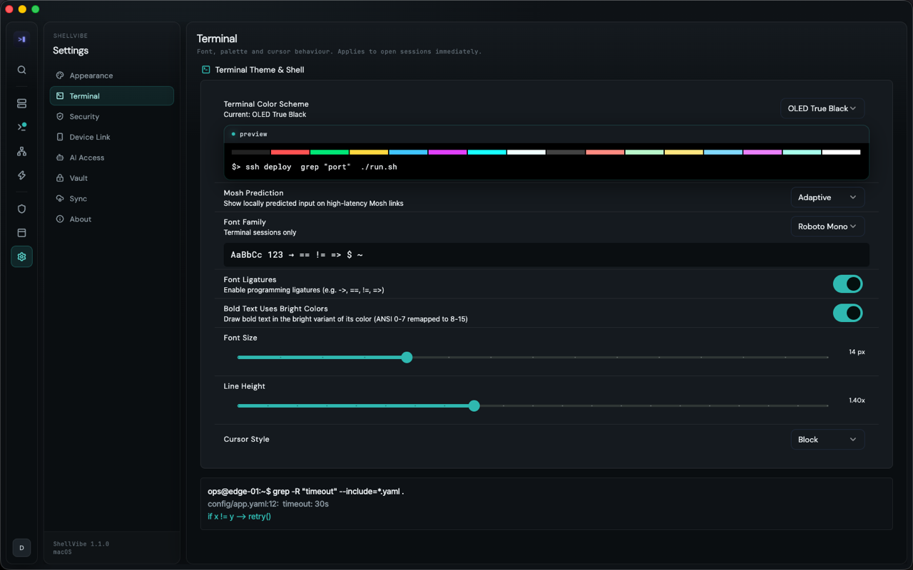

**Workspaces** — hosts, credentials, tunnels and automation scoped by context.

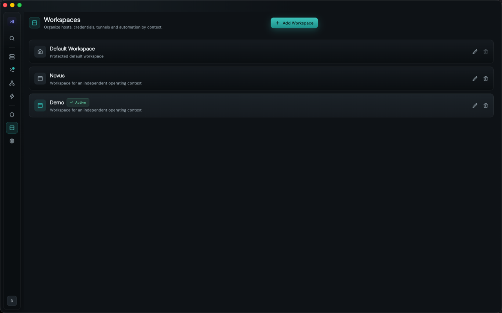

</details>

## ✨ Features

- **Local Shell** — `flutter_pty` powered local terminal (zsh/bash/pwsh) on macOS, Windows, Linux & Android (iOS sandbox aware).
- **SSHv2** — Pure Dart `dart_ssh2` engine with isolate-offloaded Key Exchange (jank-free) and TOFU host-key verification against a `known_hosts` store.
- **Split panes & layouts** — Tabs split side by side or top/bottom, panes rearranged by dragging their header, a right-click menu on every pane, broadcast input, and a whole tab-and-pane arrangement saved as a template to run again.
- **Bookmarks & command palette** — Star a host or a saved layout and it leads the ⌘K palette, the Connect to Host panel and the terminal's empty screen, so a server opens from anywhere.
- **Dual-pane SFTP** — Background transfer queue, atomic uploads (temp + rename), in-app remote file editor, chmod/chown, path-traversal protection.
- **Visual Tunnels** — Local (`-L`), Remote (`-R`) and Dynamic SOCKS5 (`-D`) port forwarding with live throughput stats.
- **Identity Vault** — Argon2id + AES-256-GCM Zero-Knowledge encryption. Master password protected DEK/KEK architecture, brute-force lockout and auto-lock on background.
- **Snippets & Runbooks** — `${INPUT:variable}` parameterised commands and multi-step runbook execution with exit-code / regex output verification.
- **Workspaces** — Isolated workspace scoping for hosts, identities, tunnels and automation; switched by clicking the workspace card.
- **AI access (MCP)** — A localhost-only MCP server, off by default per workspace, that gives an agent (Claude Code, Claude Desktop, any MCP client) `list_hosts`, `describe_host`, `request_host_access`, `open_session`, `run_command`, `interrupt`, `close_session` and `list_sessions` — under per-host approval and policy, with an audit log and a kill switch, and never a stored credential.
- **Device Link** — Pair a phone over your own LAN with a QR code and take a session over from the other device.
- **E2EE Cloud Sync** — Self-contained encrypted backup export/import (DEK wrapped with backup password, re-wrapping of secrets across devices).
- **Design System** — "Quiet Ops" theme with 7+ dark palettes (OLED, Catppuccin, Nord, Dracula, Solarized, TokyoNight, Gruvbox) via Shadcn UI.

Release-by-release detail lives in [`CHANGELOG.md`](CHANGELOG.md).

## 🧱 Tech Stack

| Layer | Technology |
| :--- | :--- |
| Framework | Flutter SDK 3.x / Dart SDK `^3.12.2` |
| State | `flutter_riverpod` 3.x + `riverpod_annotation` (codegen) |
| Terminal UI | `xterm3` (maintained fork) |
| SSH / SFTP | `dart_ssh2` (Pure Dart) |
| Local PTY | `flutter_pty` |
| Database | `drift` (SQLite) — 18 tables, schema version 9, migrated in place |
| Secure Storage | `flutter_secure_storage` (Keychain / KeyStore / Credential Manager) |
| Crypto | `cryptography` — AES-256-GCM + Argon2id |
| Routing | `go_router` (declarative, vault-gated) |
| Desktop | `window_manager`, `tray_manager`, `hotkey_manager`, `desktop_drop` |
| UI Kit | `shadcn_ui`, `lucide_icons_flutter`, `google_fonts` |

## 📁 Project Layout

```
shellvibe/
└── lib/
    ├── main.dart
    ├── app/            # router, theme, navigation shell
    ├── core/           # crypto, network (SSH/SOCKS5/PTY), mcp, sync, utils
    ├── features/       # terminal, hosts, sftp, tunnels, vault, snippets, templates,
    │                   # bookmarks, workspaces, device_link, mcp, settings
    │   └── <feature>/{data,domain,presentation}
    └── shared/         # drift database (tables/DAOs), providers, secure storage
```

See [`AGENTS.md`](AGENTS.md) for the architecture map and the conventions this codebase is written to.

## 📥 Installing

Builds for macOS, Windows and Linux are attached to each
[release](https://github.com/klc/shellvibe/releases), with a `SHA256SUMS` file
to check them against. The macOS build requires **macOS 12 (Monterey) or
newer**; Windows and Linux carry no version floor beyond a current desktop.

**They are not code-signed yet**, so your operating system will warn you that it
cannot tell who built them. The warning is accurate — verify the checksums
first. To get past it:

- **macOS** — open it once and let it be blocked, then **System Settings →
  Privacy & Security → Open Anyway**. macOS 15 removed the Control-click
  shortcut, so this is the only route, and it repeats after every update.
- **Windows** — "Windows protected your PC" → **More info** → **Run anyway**.
- **Linux** — `chmod +x` the AppImage and run it. Nothing else needed.

If disabling malware protection for an SSH client is not a trade you want to
make, build it yourself with the steps below. That is a reasonable position and
the source is right here.

## 🚀 Getting Started

```bash
# Install dependencies
flutter pub get

# Run code generation (Drift, Riverpod)
dart run build_runner build

# Run the app (choose a platform)
flutter run -d macos     # or windows / linux / ios / android

# Static analysis & tests
dart analyze
flutter test
```

> The first build runs Drift & Riverpod code generation. Generated files (`*.g.dart`) are committed so a clean checkout builds without `build_runner`.

## 🔒 Security Model

- SSH host keys are verified (SHA-256) against a `known_hosts` table — mismatched keys are **never** accepted through the normal connect flow (MitM protection).
- Identity secrets (passwords, private keys, passphrases) are encrypted with a random Data Encryption Key (DEK). With a master password configured, the DEK is stored only in its AES-256-GCM wrapped form and the plaintext copy is purged from the keychain.
- Failed unlock attempts trigger exponential back-off lockout (30s → … → 1h).
- SFTP operations mitigate path-traversal (slip) attacks and uploads use atomic temp-file + rename commits.
- AI access is off by default in every workspace. When it is on, the MCP server listens on `127.0.0.1` only, an agent sees a host as an opaque id rather than a hostname or credential, each host is granted read-only or read-write by hand, every tool call is written to an audit log, and one button cuts all agent access.

### macOS App Sandbox is disabled

`macos/Runner/Release.entitlements` sets `com.apple.security.app-sandbox` to `false` in **release as well as debug**. This is deliberate: the Local Shell feature spawns the user's real login shell via `flutter_pty`, which a sandboxed process may not do (it can neither exec arbitrary binaries nor reach files outside its container), so under the sandbox the local terminal is unusable.

Consequences to keep in mind:

- The app **cannot** be distributed through the Mac App Store, which requires the sandbox. Direct distribution (Developer ID + notarization) is the only path.
- Release builds run with the same filesystem reach as the user, so a bug in path handling is not contained by the OS. The SFTP path-traversal checks above are load-bearing, not defence in depth.
- Signing team lives in `macos/Runner/Configs/Signing.xcconfig`; override it locally with a git-ignored `LocalSigning.xcconfig` rather than editing `project.pbxproj`.

### Privacy

ShellVibe has no account, no analytics, no telemetry and no crash reporting, and
we run no server it could talk to. It reaches the network in four places only:
the hosts you connect to, a manual update check you press a button for, the font
CDN if you pick a non-bundled font, and Device Link over your own LAN.
[`PRIVACY.md`](PRIVACY.md) walks through each one.

See [`AGENTS.md`](AGENTS.md) for the module breakdown and the invariants each subsystem is expected to hold.

## Release engineering

Every push and pull request is scanned for secrets over the full history, then
analysed and tested on Linux, macOS and Windows.

A `vX.Y.Z` tag builds and packages all three desktop platforms — a signed and
notarized DMG, a signed Windows installer, an AppImage — and opens a draft
GitHub Release carrying every artifact and a `SHA256SUMS` file. Publishing is a
person pressing a button, never a side effect of pushing a tag. Builds made
without signing credentials are marked `unsigned` in the file name and say so
in the release notes.

## 📄 License

**Source available**, under the Functional Source License 1.1 with an Apache
2.0 future licence (`FSL-1.1-ALv2`) — see [`LICENSE`](LICENSE).

Use it, read it, change it, fork it, run it at work. The one thing the licence
withholds is a *Competing Use*: shipping ShellVibe, or something substantially
like it, as your own commercial product or service. Every release converts to
Apache 2.0 two years after we publish it.

This is fair source, not OSI-approved open source, and we do not call it open
source. [`LICENSING.md`](LICENSING.md) sets out what that means in practice.

The ShellVibe name, logo and icons are **not** covered by the licence — see
[`TRADEMARK.md`](TRADEMARK.md). Fork freely; ship under your own name.

Contributions require a signed CLA, for reasons stated plainly in
[`CONTRIBUTING.md`](CONTRIBUTING.md). The package remains excluded from pub.dev
with `publish_to: 'none'`.
