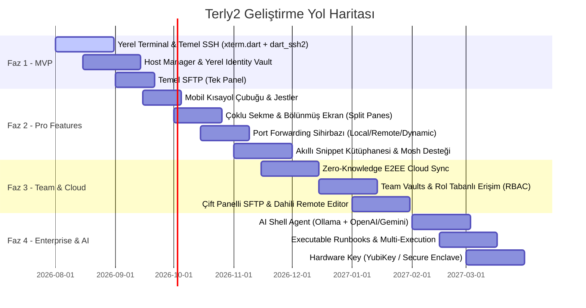

# Terly2 — Ürün Özellikleri ve Rakip Analizi Dökümanı (Product Specification & Competitor Benchmark)

> **Amaç:** Termius, Warp, Tabby, Blink Shell ve MobaXterm gibi pazar lideri terminal uygulamalarının güçlü ve zayıf yönlerini analiz ederek; masaüstü (macOS, Windows, Linux) ve mobil (iOS, Android) platformlarda çalışan, yüksek performanslı, güvenli ve modern bir **Terminal & Uzak Altyapı Yönetim Workstation'ı** için işlevsel gereksinim dökümanını (Feature Spec) oluşturmak.

---

## 1. Stratejik Vizyon ve Değer Önerisi

Pulvarize olmuş terminal ekosisteminde kullanıcılar genellikle ikiye ayrılmaktadır:
1. **Geleneksel SSH İstemcileri (Termius, SecureCRT, MobaXterm):** Bağlantı ve sunucu yönetiminde başarılı, ancak modern terminal arayüzlerinden (AI, blok tabanlı UI, yüksek performanslı GPU rendering) yoksun.
2. **Modern Arayüzlü Terminaller (Warp, Tabby):** Yapay zeka ve blok bazlı UX sunan ancak cross-platform mobil uyumluluğu, SFTP/Port Forwarding ve takım yönetimi tarafında yetersiz kalan çözümler.

**Terly2 Vizyonu:** Flutter'ın tek kod tabanı gücüyle; Termius'un sunucu/takım yönetimini, Warp'ın yapay zeka ve blok deneyimini, Tabby'nin özelleştirilebilir yapısını ve Blink Shell'in mobil Mosh kalitesini tek bir **Zero-Knowledge Encrypted** ürün altında birleştirmek.

---

## 2. Derinlemesine Rakip Analizi (Competitor Benchmark)

| Özellik / Kriter | **Termius** | **Warp** | **Tabby** | **Blink Shell** | **MobaXterm** | **Terly2 (Hedef)** |
| :--- | :--- | :--- | :--- | :--- | :--- | :--- |
| **Desteklenen Platformlar** | macOS, Win, Linux, iOS, Android | macOS, Linux, Windows (Beta) | macOS, Win, Linux | iOS, iPadOS | Windows | **macOS, Win, Linux, iOS, Android** |
| **Mimari / Altyapı** | Electron / React Native | Rust / Native UI | Electron / Angular | Native (iOS C/ObjC) | Win32 / C++ | **Flutter + Dart (Skia/Impeller)** |
| **Protokol Desteği** | SSH, Mosh, Local | Local, SSH | SSH, Serial, Telnet, Local | SSH, Mosh | SSH, RDP, VNC, X11, Serial, Telnet, FTP, SFTP | **SSH, Mosh, Local, Serial, SFTP, SOCKS5** |
| **SFTP / Dosya Transferi** | Çift panelli GUI SFTP | Yok / Temel | Temel SFTP | Files App Entegrasyonu | Tam teşekküllü SFTP + Drag-drop | **Çift panelli GUI SFTP + Arka plan kuyruğu** |
| **Port Forwarding UI** | Görsel Tünel Sihirbazı | Yok | Yok | Komut satırı | Gelişmiş Tünel Yöneticisi | **Görsel Tünel Matrisi (Local/Remote/Dynamic)** |
| **Yapay Zeka (AI) Entegrasyonu**| Autocomplete (Helium) | Üst Düzey (AI Agent, Error Explain, Natural Language) | Eklenti ile | Yok | Yok | **Yerel/Bulut AI Terminal Asistanı + Natural Language to Shell** |
| **Mobil Arayüz Deneyimi** | Yüksek (Özel klavye barı) | Yok | Yok | Çok Yüksek (iPad/VSCode) | Yok | **Özel mobil kısayol barı + Jest tabanlı yönetim** |
| **Takım & Bulut Senkronizasyonu**| Team Vaults, E2EE | Cloud Workflows | İsteğe bağlı self-hosted | iCloud | Konfigürasyon aktarımı | **Zero-Knowledge E2EE Team Vaults & Cloud Sync** |
| **Lisans / Model** | Freemium (Pahalı Abonelik) | Freemium | Açık Kaynak (Ücretsiz) | Tek seferlik / Abonelik | Freemium | **Freemium / Open-Core** |

### Rakip Analizinden Çıkarılan Fırsat Penceresi (Gap Analysis)
- **Termius'un Zayıf Yanı:** PTT / Electron altyapısı sebebiyle ağır çalışması, pahalı takım fiyatlandırması ve AI komut tamamlama yeteneklerinin zayıf olması.
- **Warp'ın Zayıf Yanı:** Mobil (iOS/Android) desteğinin hiç olmaması, geleneksel SFTP ve SSH Vault mimarisinin yetersizliği.
- **Blink Shell'in Zayıf Yanı:** Yalnızca Apple ekosistemine (iOS/iPadOS) kilitli kalması.
- **Fırsat:** Flutter ile masaüstünde ultra hızlı, mobilde kusursuz dokunmatik deneyimi sunan, E2EE şifreli, AI destekli ve zengin SFTP/Tünelleme özelliklerine sahip **tek cross-platform çözüm olmak.**

---

## 3. Detaylı Özellik Listesi & Gereksinim Spesifikasyonu (Feature Spec)

---

### Modül 1: Yerel & Uzak Bağlantı Katmanı (Protocols & Shell Engine)

#### 1.1. Local Terminal (Yerel Kabuk)
- **Platform Kabuk Desteği:** 
  - macOS & Linux: Zsh, Bash, Fish.
  - Windows: PowerShell Core (`pwsh`), Windows PowerShell, CMD, WSL2 (Ubuntu/Debian vb. otomatik tespit).
- **Yerel Ortam Özellikleri:** Cihazdaki ortam değişkenlerini (ENV), alias'ları ve mevcut profil ayarlarını otomatik okuma.

#### 1.2. SSH (Secure Shell) İstemcisi
- **Protokol Desteği:** SSHv2 tam uyumluluğu.
- **Kimlik Doğrulama Yöntemleri:**
  - Şifre (Password authentication).
  - SSH Public/Private Key (RSA 2048/4096, Ed25519, ECDSA).
  - Passphrase korumalı özel anahtarlar.
  - Interactive / Keyboard-interactive 2FA (TOTP, SMS OTP istemleri).
- **Agent Forwarding:** Yerel SSH-Agent (ssh-agent, Pageant) ve donanımsal anahtarların uzak sunucuya güvenle iletilmesi.
- **Jump Hosts / Bastion Chains:** Ara sunucular (ProxyJump) üzerinden sıralı sıçrama (Host A -> Host B -> Target Server) desteği.
- **SSH Config Import/Export:** Cihazdaki `~/.ssh/config` dosyasını okuyup otomatik host/identity haritası çıkarma.

#### 1.3. Mosh (Mobile Shell) Desteği
- **Kesintisiz Mobil Bağlantı (uygulandı):** Wi-Fi'dan mobil veriye geçişte (IP değişiminde) veya cihaz uykuya girdiğinde bağlantının kopmaması (UDP tabanlı roaming). Saf Dart transport; C binary bundle'ı yok, tüm platformlarda çalışır.
- **Yerel Ekran Yankısı (Local Echo):** Yüksek gecikmeli ağlarda yazılan karakterlerin anında görünmesi. **Henüz yok** — `echoAcks` altyapısı hazır, predictor motoru ayrı iş.
- **Kapsam sınırları:** Jump host üzerinden Mosh çalışmaz (UDP tünellenemez, UI engelliyor). Uygulama OS tarafından öldürülürse oturuma reattach edilemez (protokol izin vermiyor); karşı önlem `tmux`.

#### 1.4. Serial Port / COM & Network Protocols (İleri Seviye)
- **Serial Connection:** IoT cihazları, router ve switch'ler için USB-to-Serial (COM port, `/dev/ttyUSB*`) bağlantı arayüzü. Baud rate, parity, stop bits, flow control ayarları.
- **Hex Dump Mode:** Seri porttan gelen ham veriyi hexadecimal formatta görüntüleme.

---

### Modül 2: Port Yönlendirme & Tünelleme (Port Forwarding & Tunnels)

#### 2.1. Tünel Türleri
- **Local Port Forwarding (`-L`):** Remote sunucudaki bir servisi (ör. uzak PostgreSQL `5432`) yerel makinenin portuna (`localhost:5432`) yönlendirme.
- **Remote Port Forwarding (`-R`):** Yerel makinedeki bir servisi (ör. yerel web sunucusu `8080`) uzak sunucunun dış portuna yönlendirme.
- **Dynamic Port Forwarding (`-D`):** SOCKS5 proxy oluşturarak yerel tarayıcı veya uygulamaların tüm trafiğini SSH sunucusu üzerinden güvenle geçirme.

#### 2.2. Görsel Tünel Matrisi & Yönetimi (Visual Tunnel Manager)
- **Grafiksel Tünel Sihirbazı:** Form doldurur gibi tıklayarak tünel kuralı oluşturma (Kaynak IP/Port -> Bastion -> Hedef IP/Port).
- **Aktif Tünel Monitörü:** Çalışan tünellerin canlı bant genişliği (upload/download hızı), aktarılan toplam veri ve bağlantı durumunu gösteren dashboard.
- **Tek Tıkla Aktifleştirme:** Sık kullanılan tünel kurallarını kaydedip ana ekrandan açıp kapatabilme.

---

### Modül 3: SFTP & SCP Dosya Yöneticisi (File Transfer & Editor)

#### 3.1. Çift Panelli SFTP Arayüzü (Dual-Pane GUI)
- **Esnek Panel Yapısı:**
  - Sol Panel: Yerel Dosya Sistemi (veya 1. Sunucu)
  - Sağ Panel: Uzak Sunucu Dosya Sistemi (veya 2. Sunucu)
- **Sürükle & Bırak (Drag & Drop):** Masaüstünden veya paneller arası dosya/klasör sürükleyerek transfer başlatma.

#### 3.2. Gelişmiş Transfer Yönetimi
- **Transfer Kuyruğu (Queue Manager):** Eşzamanlı dosya indirme/yükleme hızı sınırlama, duraklatma (pause), devam ettirme (resume).
- **Arka Plan Transferi:** Büyük dosyaların transferi sırasında terminal kullanımına devam edebilme; transfer tamamlandığında sistem bildirimi (Push notification) alma.

#### 3.3. Dahili Kod & Metin Düzenleyici (In-App Remote Editor)
- **Uzak Dosya Düzenleme:** Sunucudaki `.conf`, `.yaml`, `.json`, `.py`, `.sh` vb. dosyaları çift tıklayarak dahili editörde açma.
- **Syntax Highlighting & Auto-Save:** Renklendirilmiş kod görünümü; kaydedildiği an arka planda SFTP ile sunucuda güncelleme.
- **Dosya İzinleri Yönetimi:** Grafiksel `chmod` (755, 644) ve `chown` izin değiştirme penceresi.

---

### Modül 4: Sunucu & Kimlik Yönetimi (Host & Identity Vault)

#### 4.1. Sunucu ve Grup Organizasyonu (Host Manager)
- **Hiyerarşik Ağaç Yapısı:** Sunucuları klasörler/gruplar halinde düzenleme (ör. `Production` -> `AWS-EU` -> `Web-Servers`).
- **Grup Düzeyinde Miras (Inheritance):** Bir gruba tanımlanan varsayılan kullanıcı adı, SSH anahtarı veya port bilgisinin gruptaki tüm sunuculara otomatik uygulanması.
- **Etiketleme & Renk Kodları:** Sunuculara renkli etiketler (ör. `Prod - Red`, `Staging - Green`) atayarak terminal sekmesinde görsel uyarı sağlama (yanlışlıkla prod sunucuda komut çalıştırmayı önleme).

#### 4.2. Kimlik Deposu (Identity Vault)
- **Ayrıştırılmış Kimlikler:** Kullanıcı adı, şifre ve SSH anahtarlarını sunucu tanımından bağımsız bir "Identity" nesnesi olarak saklama. Tek bir identity'yi 50 farklı sunucuya bağlayabilme.
- **Hardware Security Key Desteği:**
  - YubiKey (FIDO2 / PKCS#11 / Smartcard) entegrasyonu.
  - Apple Secure Enclave & Android Keystore donanımsal şifreleme modülleri ile SSH anahtar üretimi.

---

### Modül 5: Çalışma Alanları, Takım & Senkronizasyon (Workspaces & Team Vaults)

#### 5.1. Çalışma Alanları (Workspaces)
- **Bağlam Ayrımı:** İş, Kişisel ve Müşteri projeleri için tamamen bağımsız Çalışma Alanları (Workspaces) oluşturma. Her workspace kendi host listesine, tünellerine ve snippet'larına sahiptir.

#### 5.2. Uçtan Uca Şifreli Bulut Senkronizasyonu (Zero-Knowledge E2EE Sync)
- **Zero-Knowledge Architecture:** Tüm veriler (host'lar, şifreler, SSH key'ler, snippet'lar) cihazda kullanıcıya özel **Master Key / Passphrase** ile AES-256-GCM algoritmasıyla şifrelenir.
- **Bulut Sağlayıcı Esnekliği:**
  - Terly2 Cloud Sync (Dahili güvenli senkronizasyon).
  - Self-Hosted Sync (Kullanıcının kendi Supabase, Firebase veya Custom Relay server'ı üzerinden senkronize olabilme imkanı).

#### 5.3. Takım Paylaşımı & Rol Tabanlı Erişim (Team Vaults & RBAC)
- **Paylaşımlı Kasa (Team Vault):** Şirket veya takım içi sunucu altyapısını güvenle paylaşma.
- **Roller ve İzinler:**
  - *Admin:* Sunucu ekler, siler, izinleri yönetir.
  - *Operator:* Sunucuya bağlanır ve tanımlı snippet'ları çalıştırır ancak SSH anahtarını veya şifreyi göremez/kopyalayamaz.
  - *Read-Only:* Sadece sunucu listesini ve durumunu görür.
- **Denetim İzleri (Audit Logs):** Kimin ne zaman hangi sunucuya bağlandığını kayıt altına alma.

---

### Modül 6: Otomasyon & Verimlilik (Snippets, Runbooks & AI)

#### 6.1. Akıllı Snippet Kütüphanesi
- **Dinamik Değişkenler:** Snippet içine `${INPUT:Port_Numarasi}`, `${HOST_IP}`, `${USER}` gibi parametreler koyarak çalıştırılma anında kullanıcıdan değer isteme.
- **Snippet Paketleri & Paylaşım:** Sık kullanılan Docker, Nginx, Kubernetes komut setlerini paketleyip takımla paylaşma.

#### 6.2. Yürütülebilir Senaryolar (Executable Runbooks)
- **Çok Adımlı Otomasyon:** Sırayla çalışacak komut zincirleri tanımlama:
  - Adım 1: `docker-compose down`
  - Adım 2: `git pull origin main`
  - Adım 3: `docker-compose up -d --build`
- **Şartlı Adım Mantığı:** Bir önceki komutun exit code'u `0` değilse akışı durdurup uyarı verme.

#### 6.3. Çoklu Sunucuda Eşzamanlı Komut Çalıştırma (Multi-Execution Broadcast)
- **Broadcast Input Mode:** Açık olan 10 farklı terminal sekmesine tek bir klavye girdisini aynı anda gönderme (ör. 10 sunucuda birden `apt update && apt upgrade` çalıştırma).

#### 6.4. Yapay Zeka Terminal Asistanı (AI Shell Agent)
- **Natural Language to Shell:** *"Docker'daki tüm durdurulmuş konteynerleri ve kullanılmayan imajları temizle"* -> `docker system prune -a --volumes`.
- **Hata Açıklama & Çözüm Önerisi (Error Explainer):** Terminalde alınan bir hatayı seçip "AI ile Açıkla" butonuna basarak hatanın kök nedenini ve düzeltme komutunu alma.
- **Yerel LLM Desteği:** Gizlilik odaklı kullanıcılar için Ollama / LocalAI entegrasyonu (verilerin dışarı gitmemesi için).

---

### Modül 7: Terminal UX & Arayüz Mimarisi (Desktop & Mobile Adaptability)

#### 7.1. Arayüz Düzeni (Tabs, Splits & Blocks)
- **Sekme & Bölünmüş Ekran (Tabs & Split Panes):**
  - Sürükle-bırak destekli sekmeler.
  - Dikey (Vertical) ve Yatay (Horizontal) sınırsız ekran bölme (Grid Layout).
- **İki Farklı Görünüm Modu:**
  1. *Geleneksel Terminal Modu:* Standart akıcı ANSI terminal ekranı.
  2. *Warp-Style Blok Modu:* Komutlar ve çıktıların ayrı kartlar (bloklar) halinde gruplandığı, çıktının tek tıkla kopyalandığı mod.

#### 7.2. Mobil UX (Extra Key Bar & Gestures)
- **Mobil Kısayol Çubuğu (Custom Extra Keys Bar):** Dokunmatik klavyenin üzerinde yer alan özelleştirilebilir tuş şeridi: `Esc`, `Tab`, `Ctrl`, `Alt`, `|`, `~`, `/`, `-`, `Ok Tuşları`, `Fn`.
- **Özel Makro Tuşları:** Sık kullanılan `sudo `, `clear`, `htop`, `exit` gibi komutları tek tık tuşuna dönüştürme.
- **Jest Kontrolleri:** İki parmakla font büyütme/küçültme (pinch-to-zoom), sağa/sola kaydırarak sekmeler arası geçiş.

#### 7.3. Tema Motoru & Render Performansı
- **Metal / OpenGL / Vulkan Donanım İvmesi:** `xterm.dart` katmanında 60+ FPS akıcı kaydırma ve düşük gecikme (sub-millisecond latency).
- **Zengin Tema Kütüphanesi:** Dracula, Nord, One Dark, Solarized, Catppuccin ve OLED Pure Black temaları. Custom CSS / JSON tema içe aktarma.

---

### Modül 8: Güvenlik, Uyum ve Şifreleme (Security & Compliance)

- **Biometric / Master Password Lock:** Uygulama açılışında veya arka plandan dönüldüğünde FaceID, TouchID, Windows Hello veya Master Password zorunluluğu.
- **Zero-Knowledge Encryption:** Veritabanının tamamı (Isar/Hive) kullanıcı anahtarı türetimli AES-256-GCM ile disk üzerinde şifreli saklanır.
- **Otomatik Pano Temizliği (Clipboard Auto-Clear):** Kopyalanan şifre veya SSH anahtarlarının 30 saniye sonra panodan otomatik silinmesi.
- **Oturum Kaydı (Session Logs / Recording):** Güvenlik denetimleri için yapılan SSH oturumlarının metin veya video benzeri (asciinema formatında) kaydının tutulması.

---

## 4. Uygulama Faz Haritası (Product Release Roadmap)

---

## 5. Özet ve Sonraki Adımlar

Bu döküman, **Terly2** projesinin rakip analizini ve işlevsel gereksinimler setini eksiksiz bir şekilde tanımlamaktadır.

**Sonraki Adım (Siz Onay Verince):**
1. Bu özellik setine uygun **Teknik Mimari Spesifikasyonu (Tech Spec)** dökümanının hazırlanması (`folder structure`, `state management: Riverpod/Bloc`, `xterm.dart & dart_ssh2 entegrasyon mimarisi`, `database & security layer`).
2. Flutter projesinin temiz mimari (Clean Architecture) prensiplerine göre iskeletinin oluşturulması.
