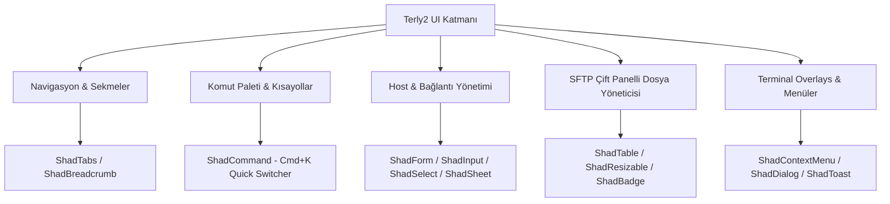

# Terly2 — Shadcn UI Araştırma ve Entegrasyon Mimari Raporu

> **Doküman Türü:** Mimari Araştırma ve Entegrasyon Spesifikasyonu  
> **Hedef:** Terly2 Flutter Masaüstü ve Mobil SSH/SFTP istemcisi için `shadcn/ui` tasarım sisteminin incelenmesi, paket karşılaştırmaları, mimari uyumu ve teknik uygulama planı.  
> **Tarih:** Ağustos 2026  

---

## 1. Yönetici Özeti (Executive Summary)

**`shadcn/ui`**, modern web ve masaüstü geliştirme dünyasında (özellikle Warp Terminal, Vercel, Linear gibi üst düzey geliştirici araçlarında) sade, minimal, yüksek erişilebilirliğe sahip ve koyu tema (dark mode) odaklı estetiğiyle standart haline gelmiş bir tasarım sistemidir.

Terly2 projesinde (Flutter SDK 3.x / Dart 3.x), varsayılan Material Design 3 veya Cupertino görselleri yerine `shadcn/ui` estetiğini benimsemek:
1. **Geliştirici Odaklı Premium Görünüm:** Terminal, SSH istemcisi ve SFTP dosya yöneticisi gibi teknik araçlarda temiz 1px kenarlıklar, slate/zinc koyu renk paletleri ve keskin tipografi sunar.
2. **Platform Bağımsızlığı:** Material/Cupertino mobil hissini kırarak macOS, Windows, Linux ve mobil platformlarda ortak, tutarlı bir "workstation" görünümü sağlar.
3. **Bileşen Zenginliği:** Formlar, diyaloglar, drawer/sheet yapıları, komut paleti (Cmd+K), sağ tık bağlam menüleri (context menu) ve toast bildirimleri gibi Terly2'nin ihtiyaç duyduğu tüm temel bileşenleri kapsar.

---

## 2. Flutter Ekosistemindeki `shadcn/ui` Paketlerinin Karşılaştırılması

React/Tailwind ekosistemindeki orijinal `shadcn/ui` kütüphanesini Flutter'a uyarlayan topluluk tarafından geliştirilmiş başlıca çözümler şunlardır:

| Kriter | **`shadcn_ui`** (nank1ro) ⭐ **(Önerilen)** | **`shadcn_flutter`** (sunarya-thito) | **`forui`** (Widgetbook / Topluluk) |
| :--- | :--- | :--- | :--- |
| **Yaklaşım** | `shadcn/ui` bileşenlerinin doğrudan ve modüler Flutter widget karşılıkları. | Tüm UI ekosistemini baştan tanımlayan kapsamlı bir framework. | `shadcn/ui` felsefesinden esinlenmiş bağımsız minimal UI kütüphanesi. |
| **Material/Cupertino Bağımlılığı** | Bağımsız çalışır; isteğe bağlı Material/Cupertino ile hibrit kullanılabilir. | Tamamen kendi widget ağacını yönetir. | Bağımsız minimal widget seti. |
| **Bileşen Sayısı** | **80+ Kapsamlı Bileşen** (Button, Dialog, Sheet, Command, Table, Context Menu vb.) | 50+ Kapsamlı Bileşen | 30+ Temel Bileşen |
| **Tema Sistemi** | `ShadThemeData`, `ShadZincColorScheme`, `ShadSlateColorScheme` (Işık/Koyu desteği). | Kendi `ThemeData` yapısı. | Custom `FThemeData` yapısı. |
| **İkon Ekosistemi** | `lucide_icons_flutter` ile %100 birebir uyum. | Kendi ikon seti / Lucide. | Remix / Custom ikonlar. |
| **Riverpod & `go_router` Uyuşumu** | `ShadApp.router` sayesinde `go_router` ve `flutter_riverpod` ile tam entegrasyon. | Özel router/state yapıları gerektirebilir. | Standart `MaterialApp.router` wrapper gerektirir. |
| **Kararlılık ve Popülerlik** | Pub.dev üzerinde en yaygın ve aktif geliştirilen paket. | Gelişmiş fakat daha dik öğrenme eğrisi. | Tasarım harika, fakat bileşen yelpazesi daha dar. |

> [!TIP]
> **Karar:** Terly2 için **`shadcn_ui`** (nank1ro) paketi ve ikonografi için **`lucide_icons_flutter`** kombinasyonu seçilmiştir. Sebebi; `go_router`, Riverpod, `xterm2` ve `window_manager` ile sorunsuz entegre olabilmesi ve en geniş bileşen kütüphanesine sahip olmasıdır.

---

## 3. Terly2 Özellikleri ile `shadcn_ui` Bileşen Eşleşmesi

Terly2'nin teknik mimari belgesinde (`docs/tech_spec.md`) belirtilen modülleri ile `shadcn_ui` widget'larının eşleşme haritası aşağıda sunulmuştur:



### 3.1. Detaylı Bileşen Haritası

1. **Sekmeli SSH/SFTP Oturum Alanı (Session Workspace):**
   - **`ShadTabs` & `ShadTabList`:** Çoklu SSH oturumu sekmeleri, aktif tünel göstergeleri, sekme kapatma ve sürükle-bırak organizasyonu.
   - **`ShadResizable`:** Split-screen (dikey/yatay bölünmüş terminal pencereleri) ve SFTP yerel/uzak sunucu panelleri arasındaki boyutlandırma çubuğu.

2. **Hızlı Komut Paleti (Quick Command Switcher - `Cmd+K` / `Ctrl+K`):**
   - **`ShadCommand`:** Warp/Raycast tarzı tüm SSH sunucularına, kaydedilmiş snippet'lara ve aktif tünellere tek klavye kısayoluyla erişim.

3. **Sunucu (Host) & Tünel Yönetim Formları:**
   - **`ShadForm` & `ShadInput`:** IP adresi, port, SSH kullanıcı adı, Parola / Private Key seçim girdileri.
   - **`ShadSelect` & `ShadRadioGroup`:** Tünel türü seçimi (Local, Remote, Dynamic SOCKS5), SSH Key algoritmaları (Ed25519, RSA).
   - **`ShadSwitch` & `ShadCheckbox`:** "Auto-reconnect", "Keep-alive", "Strict Host Key Checking" anahtarları.
   - **`ShadSheet` (Drawer):** Sağdan açılan hızlı Host detay ve düzenleme paneli.

4. **Terminal İçi Bağlam Menüsü & Bildirimler:**
   - **`ShadContextMenu`:** Terminal üzerine sağ tıklandığında açılan "Copy", "Paste", "Clear Buffer", "Split Terminal", "Port Forward" menüsü.
   - **`ShadDialog`:** SSH İlk Bağlantı Fingerprint Doğrulama (`SHA-256`) ve Passphrase şifre sorma diyalogları.
   - **`ShadToast` / `ShadSonner`:** SFTP dosya aktarımı tamamlandı/hata oluştu bildirimleri, SSH bağlantı koptu uyarıları.

---

## 4. Mimari Yapı ve Entegrasyon Adımları

### 4.1. `pubspec.yaml` Bağımlılık Güncellemesi

Projenin `pubspec.yaml` dosyasına eklenecek paketler:

```yaml
dependencies:
  flutter:
    sdk: flutter

  # UI Framework & Design System
  shadcn_ui: ^0.9.3
  lucide_icons_flutter: ^0.4.0

  # State Management & Routing
  flutter_riverpod: ^3.3.1
  go_router: ^17.3.0

  # Terminal Engine
  xterm2: ^5.2.0
```

### 4.2. Kök Uygulama Konfigürasyonu (`ShadApp.router`)

Terly2'nin `lib/main.dart` veya `lib/app.dart` dosyasında `ShadApp.router` kullanımı:

```dart
import 'package:flutter/material.dart';
import 'package:flutter_riverpod/flutter_riverpod.dart';
import 'package:shadcn_ui/shadcn_ui.dart';
import 'core/router/app_router.dart';
import 'core/theme/terly_theme.dart';

void main() {
  runApp(
    const ProviderScope(
      child: TerlyApp(),
    ),
  );
}

class TerlyApp extends ConsumerWidget {
  const TerlyApp({super.key});

  @override
  Widget build(BuildContext context, WidgetRef ref) {
    final router = ref.watch(appRouterProvider);

    return ShadApp.router(
      title: 'Terly2 Workspace',
      debugShowCheckedModeBanner: false,
      
      // Tema Yapılandırması (Slate Dark varsayılan)
      theme: TerlyTheme.lightTheme,
      darkTheme: TerlyTheme.darkTheme,
      themeMode: ThemeMode.dark, // Terly2 varsayılan olarak koyu moddadır

      // go_router Entegrasyonu
      routerConfig: router,
    );
  }
}
```

### 4.3. Terly2 Özel Tasarım Sistemi ve Tema Katmanı (`lib/core/theme/terly_theme.dart`)

Terly2 terminal odaklı bir uygulama olduğu için dark mode paleti `ShadSlateColorScheme` veya `ShadZincColorScheme` üzerine kurgulanır:

```dart
import 'package:flutter/material.dart';
import 'package:shadcn_ui/shadcn_ui.dart';

abstract class TerlyTheme {
  // Slate Dark renk paleti baz alınmıştır
  static ShadThemeData get darkTheme {
    return ShadThemeData(
      brightness: Brightness.dark,
      colorScheme: const ShadSlateColorScheme.dark(
        background: Color(0xFF0F172A),   // Slate 900 - Derin Arka Plan
        foreground: Color(0xFFF8FAFC),   // Slate 50 - Ana Yazı Renk
        card: Color(0xFF1E293B),         // Slate 800 - Kartlar ve Paneller
        cardForeground: Color(0xFFF8FAFC),
        primary: Color(0xFF38BDF8),      // Sky 400 - Vurgu Renk (Active SSH/Tabs)
        primaryForeground: Color(0xFF0F172A),
        muted: Color(0xFF334155),        // Slate 700 - Pasif Öğeler
        mutedForeground: Color(0xFF94A3B8), // Slate 400 - İkincil Yazılar
        border: Color(0xFF334155),       // 1px Temiz İnce Kenarlıklar
      ),
      // Özel Bileşen Stil Ayarları
      primaryButtonTheme: const ShadButtonTheme(
        size: ShadButtonSize.sm,
      ),
      inputTheme: const ShadInputTheme(
        radius: BorderRadius.all(Radius.circular(6.0)),
      ),
    );
  }

  static ShadThemeData get lightTheme {
    return ShadThemeData(
      brightness: Brightness.light,
      colorScheme: const ShadSlateColorScheme.light(),
    );
  }
}
```

---

## 5. Örnek Kullanım Senaryoları (Code Snippets)

### 5.1. SSH Host Oluşturma Modalı (`ShadDialog` & `ShadForm`)

```dart
import 'package:flutter/material.dart';
import 'package:shadcn_ui/shadcn_ui.dart';
import 'package:lucide_icons_flutter/lucide_icons.dart';

class AddHostDialog extends StatelessWidget {
  const AddHostDialog({super.key});

  @override
  Widget build(BuildContext context) {
    return ShadDialog(
      title: const Row(
        children: [
          Icon(LucideIcons.server, size: 20),
          SizedBox(width: 8),
          Text('Yeni SSH Sunucusu Ekle'),
        ],
      ),
      description: const Text('Sunucu bağlantı bilgilerinizi giriniz.'),
      content: Container(
        width: 450,
        padding: const EdgeInsets.symmetric(vertical: 16),
        child: Column(
          mainAxisSize: MainAxisSize.min,
          children: [
            const ShadInput(
              placeholder: Text('Sunucu Etiketi (örn. Production DB)'),
              leading: Icon(LucideIcons.tag, size: 16),
            ),
            const SizedBox(height: 12),
            const Row(
              children: [
                Expanded(
                  flex: 3,
                  child: ShadInput(
                    placeholder: Text('IP veya Hostname (192.168.1.1)'),
                    leading: Icon(LucideIcons.globe, size: 16),
                  ),
                ),
                SizedBox(width: 8),
                Expanded(
                  flex: 1,
                  child: ShadInput(
                    placeholder: Text('22'),
                    initialValue: '22',
                  ),
                ),
              ],
            ),
            const SizedBox(height: 12),
            const ShadInput(
              placeholder: Text('Kullanıcı Adı (root, ubuntu)'),
              leading: Icon(LucideIcons.user, size: 16),
            ),
            const SizedBox(height: 12),
            ShadSelect<String>(
              placeholder: const Text('Kimlik Doğrulama Yöntemi'),
              options: const [
                ShadOption(value: 'key', child: Text('SSH Private Key')),
                ShadOption(value: 'password', child: Text('Parola')),
              ],
              selectedOptionBuilder: (context, value) => Text(value == 'key' ? 'SSH Private Key' : 'Parola'),
              onChanged: (val) {},
            ),
          ],
        ),
      ),
      actions: [
        ShadButton.outline(
          child: const Text('İptal'),
          onPressed: () => Navigator.of(context).pop(),
        ),
        ShadButton(
          child: const Text('Kaydet ve Bağlan'),
          onPressed: () {
            // Host kaydetme mantığı
          },
        ),
      ],
    );
  }
}
```

### 5.2. Terminal Sağ Tık Bağlam Menüsü (`ShadContextMenu`)

```dart
import 'package:flutter/material.dart';
import 'package:shadcn_ui/shadcn_ui.dart';
import 'package:lucide_icons_flutter/lucide_icons.dart';
import 'package:xterm2/xterm2.dart';

class TerminalWithContextMenu extends StatelessWidget {
  final Terminal terminal;

  const TerminalWithContextMenu({super.key, required this.terminal});

  @override
  Widget build(BuildContext context) {
    return ShadContextMenu(
      items: [
        ShadContextMenuItem(
          leading: const Icon(LucideIcons.copy, size: 16),
          trailing: const Text('Cmd+C'),
          onPressed: () {
            // Selection copy
          },
          child: const Text('Kopyala'),
        ),
        ShadContextMenuItem(
          leading: const Icon(LucideIcons.clipboard, size: 16),
          trailing: const Text('Cmd+V'),
          onPressed: () {
            // Paste to terminal
          },
          child: const Text('Yapıştır'),
        ),
        const ShadContextMenuDivider(),
        ShadContextMenuItem(
          leading: const Icon(LucideIcons.columns2, size: 16),
          onPressed: () {
            // Split vertical
          },
          child: const Text('Dikey Böl (Split Vertical)'),
        ),
        ShadContextMenuItem(
          leading: const Icon(LucideIcons.rows2, size: 16),
          onPressed: () {
            // Split horizontal
          },
          child: const Text('Yatay Böl (Split Horizontal)'),
        ),
        const ShadContextMenuDivider(),
        ShadContextMenuItem(
          leading: const Icon(LucideIcons.trash2, size: 16),
          onPressed: () {
            terminal.buffer.clear();
          },
          child: const Text('Ekranı Temizle (Clear Buffer)'),
        ),
      ],
      child: TerminalView(terminal),
    );
  }
}
```

---

## 6. Odaklanma (Focus), Klavye Navigasyonu ve Performans Notları

1. **Terminal (`xterm2`) vs UI Input Odak Yönetimi:**
   - SSH terminal alanı aktifken tüm klavye girdileri `xterm2` nesnesine yönlendirilmelidir.
   - `ShadDialog` veya `ShadCommand` (Cmd+K) açıldığında Flutter `FocusScope` otomatik olarak arayüze geçmeli, modal kapandığında odak tekrar `TerminalView`'e dönmelidir.

2. **Masaüstü Pencere Başlık Çubuğu (`window_manager`):**
   - macOS ve Windows'ta özelleştirilmiş başlık çubuğu (custom titlebar) için `ShadMenubar` veya `ShadTabs` üst alana entegre edilerek yerel pencere butonları (red/yellow/green) ile hizalanabilir.

3. **Performans (60/120 FPS):**
   - `shadcn_ui` saf Dart widget'ları kullandığı için Skia ve Impeller grafik motorlarında donanım ivmeli (hardware-accelerated) yüksek performansla çalışır.
   - Sadece sekme değişimlerinde veya modal açılışlarında `autoDispose` Riverpod provider'ları kullanılarak gereksiz build yükünün önüne geçilmelidir.

---

## 7. Sonuç ve Önerilen Yol Haritası

`shadcn/ui` (ve `shadcn_ui` Flutter paketi), Terly2 projesinin hedeflediği modern, şık ve profesyonel SSH/SFTP workstation deneyimi için ideal bir tasarım sistemidir.

### Önerilen Uygulama Adımları:
1. `pubspec.yaml` dosyasına `shadcn_ui` ve `lucide_icons_flutter` paketlerini eklemek.
2. `lib/core/theme/terly_theme.dart` altında Slate Koyu Temasını tanımlamak.
3. Kök `MaterialApp` katmanını `ShadApp.router` ile değiştirmek.
4. İlk olarak `Host Management` ve `Add Host Dialog` bileşenlerini `shadcn_ui` ile yeniden tasarlamak.
5. Terminal sağ tık bağlam menüsü (`ShadContextMenu`) ve `Cmd+K` hızlı geçiş komut paletini (`ShadCommand`) devreye almak.
