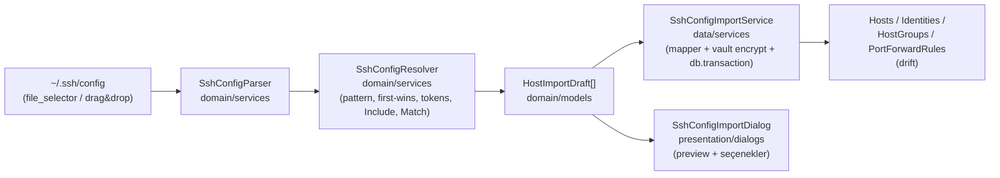

# `.ssh/config` İmport Özelliği — Araştırma ve Uygulama Planı

> Tarih: 2026-08-05
> Kapsam: `~/.ssh/config` dosyasının Terly2'ye import edilmesi (host, identity, port forward eşlemesi)

---

## 1. Araştırma Bulguları

### 1.1. Özellik zaten spesifikasyonda tanımlı
`docs/features_and_competitor_analysis.md` §1.2 (satır 60): *"**SSH Config Import/Export:** Cihazdaki `~/.ssh/config` dosyasını okuyup otomatik host/identity haritası çıkarma."* — Plan, tanımlı ürün hedefini karşılıyor; yeni kapsam genişletmesi değil.

### 1.2. Terly2 veri modeli yeterli — **DB migration gerekmez** (önemli bulgu)
Mevcut şema (`lib/shared/database/tables.dart`) `.ssh/config`'in eşlenebilir her şeyini zaten taşıyor:

| ssh_config seçeneği | Terly2 hedefi | Karşılık |
|---|---|---|
| `Host <alias>` | `Hosts.label` | Birebir |
| `HostName` | `Hosts.hostname` | Birebir |
| `User` | `Hosts.username` | Birebir |
| `Port` | `Hosts.port` (default 22) | Birebir |
| `IdentityFile` | `Identities` (authType `key`, `privateKey` içerik) | Vault şifreli |
| `ProxyJump` | `Hosts.jumpHostId` | İlk hop eşlenir |
| `LocalForward` / `RemoteForward` / `DynamicForward` | `PortForwardRules` (type `local`/`remote`/`dynamic`) | Birebir |
| Gruplama | `HostGroups` | İmport sırasında opsiyonel grup |

### 1.3. `ssh_config(5)` sözdizimi (OpenBSD man sayfasından doğrulandı)
- **First-obtained-wins**: her direktif için *ilk* belirtilen değer kullanılır. `IdentityFile` ve forward'lar istisna: **birikirler**.
- **Keyword'ler case-insensitive, argümanlar case-sensitive** — `Host` pattern eşlemesi case-sensitive yapılmalı.
- `Host` pattern'leri: boşlukla ayrılır; `*` tek başına global default; `!` ile negasyon (negatif eşleşirse stanza tümden yok sayılır); `|` alternation.
- `Match` kriterleri: `all`, `canonical`, `final`, `exec`, `localnetwork`, `host`, `originalhost`, `tagged`, `command`, `user`, `localuser`, `version`, `sessiontype`; `!` negasyon. **Kritik detay:** `Match host` **`Hostname` çözümlemesinden SONRAKİ** hedef hostname'e karşı eşleşir.
- Yorumlar: `#` ile başlayan satırlar **ve satır sonu inline `#`** (quote dışında) — ikisi de geçerli.
- Devam satırı: satır sonunda backslash ile birleşir.
- Ayraç: boşluk **veya tek `=`** (çevresi boşluk olabilir).
- `Include`: çoklu path, glob (`* ? []`), lexicographic sıra, `~` genişletme, token ve env var desteği; **absolute olmayan path'ler user config'te `~/.ssh` altından aranır**; `Host`/`Match` bloğu içinde conditional Include mümkün.
- Token'lar: `%h` (hedef host), `%p` (port), `%r` (user), `%u`, `%d` (home), `%n`, `%l`, `%j`, `%%`. `Hostname` sadece `%%` ve `%h` kabul eder.
- `ProxyJump`: `[user@]host[:port]`, virgülle çoklu hop, `none` ile kapatma; `ProxyCommand` ile ilk belirtilen kazanır.
- `LocalForward [bind:]port host:hostport`; IPv6 köşeli parantez; `/` içeren argüman = Unix socket; `RemoteForward` destinationsuz = SOCKS proxy; `RemoteForward` port 0 = dinamik port.

### 1.4. Mevcut kod tabanı durumu
- **Bağlantı akışı** (`terminal_tabs_notifier._connectSshTab`): `SSHConnectConfig` → username sırası `host.username > hostname içindeki user@ > identity.username > 'root'`; key/passphrase `identity`'den. **`jumpHostId` bağlantıda kullanılmıyor** — yalnızca DB'de saklanıyor ve UI'da görünüyor (dartssh2'de ProxyJump yok). İmport `jumpHostId`'yi yazar, çalışma zamanı hop zinciri **mevcut ayrı bir boşluk** — bu özelliğin kapsamı dışında, planda işaretlenecek.
- **Vault**: `VaultKeyService.getDek()` master password korumalı vault kilitliyken `VaultLockedException` fırlatır. Identity secret'ları DEK ile AES-256-GCM şifrelenir. → **Kilitli vault'ta key import yapılamaz** (host import edilebilir).
- **Identity dedupe**: `IdentityModel` içerik bazlı; aynı key'i birden çok host paylaşabilir → dedupe gerekli.
- **File picker yok**: `file_selector`/`file_picker` bağımlılığı yok. Ama `desktop_drop` zaten mevcut ve SFTP ekranında kullanılıyor → sürükle-bırak import ücretsiz.
- **Transaction pattern**: `e2ee_cloud_sync_service` `db.transaction` kullanıyor; `HostsDao.insertHost` da `ensureWorkspaceExists` yapıyor. Batch import aynı pattern'i izler.

---

## 2. Tasarım Kararları

| Karar | Seçim | Gerekçe |
|---|---|---|
| Dosya seçici | `file_selector` (resmi, 5 platform) | `file_picker`'dan daha hafif/resmi; macOS'ta `initialDirectory: ~/.ssh` önerisi |
| IdentityFile stratejisi | **Dosya içeriği vault'a şifreli kopyalanır** (okunabiliyorsa) | Terly'nin modeli path değil içerik tutuyor (`privateKey` alanı); mevcut mimariye tek tutarlı yol |
| Aynı key çok host'ta | Tek identity, SHA-256 içerik hash'i ile dedupe | Vault'ta key başına tek kayıt |
| Conflict (aynı alias DB'de var) | Varsayılan **skip**; seçenekler: skip / üzerine yaz / `(2)` sonekli kopyala | Kullanıcı preview'da seçer |
| Vault kilitli | Key import pasif + uyarı; host import devam eder | `VaultLockedException` yakalanır |
| Pattern eşleme | Case-sensitive glob (`* ? ! \|`), OpenSSH semantiği | Man sayfası: argümanlar case-sensitive |
| `Match exec/final/canonical/tagged/command/version/sessiontype` | Stanza atlanır + uyarı listesine eklenir | İmport anında değerlendirilemez (çalışma zamanı bağlamı gerekir) |
| `Match host` | **Çözülmüş HostName'e** karşı eşleşir | Man sayfası açıkça böyle diyor |
| `Include` | Rekürsif, glob, cycle detection; çözülemeyen include → uyarı | Masaüstünde gerçek path; mobilde picker kopyası sınırı |
| ProxyJump | İlk hop; alias veya hostname ile eşleşen import edilmiş host'a bağlanır; yoksa opsiyonel minimal host oluşturur; multi-hop → uyarı | HostModel tek `jumpHostId` tutar |
| `ProxyCommand ssh -W %h:%p <jump>` | Jump host olarak eşlenir + "yaklaşık" uyarısı; diğer komutlar → desteklenmiyor | Yaygın bastion pattern'i |
| Forward'lar | TCP olanlar eşlenir; bind_address kaydedilmez (modelde yok) + uyarı; Unix socket / remote-SOCKS / port 0 → uyarı | Model kısıtı |
| Yazım atomikliği | Tek `db.transaction`: identities + hosts + tunnel rules | Kısmi import yok |
| Parse performansı | `Isolate.run` (büyük config + Include ağacı) | UI donmasın |

**Kapsam dışı (bilinçli):** `known_hosts` import'u, `/etc/ssh/ssh_config` sistem config'i, `Match exec` değerlendirmesi, connect-time ProxyJump çalıştırması (ayrı boşluk — planda `[INFERENCE]` olarak not edilir), Export yönü (spesifikasyonda var ama ayrı iş).

---

## 3. Mimari — Yeni Dosyalar

| Dosya | Katman | Sorumluluk |
|---|---|---|
| `lib/features/hosts/domain/models/ssh_config_models.dart` | domain | `SshConfigDirective`, `SshConfigDocument`, `ResolvedSshConfig`, `HostImportDraft`, `SshConfigWarning` (satır + mesaj + severity) |
| `lib/features/hosts/domain/services/ssh_config_parser.dart` | domain | Tokenizer: yorum/continuation/quote/`=`/backslash → sıralı directive listesi. Pure Dart, IO yok |
| `lib/features/hosts/domain/services/ssh_config_resolver.dart` | domain | Pattern matcher (`* ? ! \|`, case-sensitive), first-wins birleştirme, token genişletme (`%h %p %r %u %d %%`), Include traversal (glob + cycle detection), Match değerlendirme. FileSystem girdisi soyut (`SshConfigFileLoader` callback) → test edilebilir |
| `lib/features/hosts/data/services/ssh_config_import_service.dart` | data | Draft → model eşleme; key okuma (`dart:io`, masaüstü), identity dedupe (SHA-256), DEK ile şifreleme, tek transaction'da batch insert (hosts + identities + tunnel rules + opsiyonel group/jump host); sonuç: `SshConfigImportResult { added, updated, skipped, warnings }` |
| `lib/features/hosts/presentation/providers/ssh_config_import_provider.dart` | presentation | `sshConfigImportServiceProvider` (riverpod) |
| `lib/features/hosts/presentation/dialogs/ssh_config_import_dialog.dart` | presentation | Preview + seçenekler + sonuç toast |
| `test/unit/hosts/ssh_config_parser_test.dart`, `ssh_config_resolver_test.dart`, `ssh_config_import_service_test.dart` | test | Bölüm 6 |

**Değişen dosyalar:** `hosts_screen.dart` (Import girişi + masaüstü `DropTarget`), `pubspec.yaml` (`file_selector`), `docs/tech_spec.md` (bölüm ekle). **DAO'lara dokunmaya gerek yok** — batch yazım `AppDatabase.batch` ile import service içinde (mevcut `e2ee_cloud_sync_service` pattern'i).

---

## 4. UI Akışı

1. **Giriş noktası**: `HostsScreen` başlığında "Add Host" yanına outline "Import" butonu (ikinci buton, menüye gömme — keşfedilebilirlik) + boş-state'e ikincil aksiyon. Masaüstünde ayrıca hosts listesi üstüne `DropTarget` (`desktop_drop`): adı `config` / `*.config` / `ssh_config` olan dosyalar aynı akışı başlatır.
2. **Dosya seçimi**: `file_selector` → `openFile(acceptedTypeGroups: [config]), initialDirectory: ~/.ssh` (masaüstü).
3. **Parse** (Isolate + loading spinner) → **Preview dialog**:
   - Özet: dosya yolu, bulunan host sayısı, atlanan stanza sayısı
   - Checkbox listesi: her host için `alias — user@hostname:port`, rozetler: `🔑 key`, `↗ jump`, `⇄ N forward`
   - Seçenekler: hedef grup (dropdown), conflict policy (skip/overwrite/duplicate), "private key'leri vault'a import et" (kilitliyse pasif), "port forward'ları import et", "eksik jump host'ları oluştur"
   - Collapsible **uyarı paneli**: desteklenmeyen seçenekler, çözülemeyen Include, okunamayan key dosyaları, atlanan `Match exec`, multi-hop ProxyJump vb. (satır numaralı)
4. **İmport** → tek transaction → toaster: *"N host eklendi, M atlandı, K uyarı"*. Liste drift watch ile otomatik yenilenir.

---

## 5. Uygulama Fazları

1. **Faz 0 — Bağımlılık**: `file_selector` ekle, `flutter pub get`, `dart analyze` (temiz taban çizgisi).
2. **Faz 1 — Domain parser + resolver** (+ unit testler). Bu fazın çıktısı bağımsız test edilebilir: `config → List<HostImportDraft>`.
3. **Faz 2 — Import service**: key okuma, dedupe, şifreleme, transaction'lı yazım, conflict policy, sonuç modeli (+ in-memory drift ile testler).
4. **Faz 3 — UI**: import dialog, hosts_screen butonu, file_selector entegrasyonu, loading/error/warning gösterimi (+ widget testleri).
5. **Faz 4 — Sürükle-bırak** (masaüstü) + boş-state aksiyonu.
6. **Faz 5 — Doğrulama ve dokümantasyon**: `flutter analyze` sıfır uyarı, `flutter test` tümü yeşil, `docs/tech_spec.md`'ye "SSH Config Import" alt sistemi bölümü (AGENTS.md kuralı: davranış değişikliğinde spec güncellenir).

---

## 6. Test Planı

**Parser** (pure unit): inline `#` yorum, backslash continuation, çift tırnak, `=` ayracı, boş satırlar, hatalı satır → warning.
**Resolver**: `*`/`?`/`!`/`|` semantiği, case-sensitive eşleme, first-obtained-wins sıralaması, global default + `Host *` kombinasyonu, `Match host` (HostName çözümlemesi sonrası) / `Match user` / `Match all` / `Match !`, token genişletme (`%h %p %r %d %%`), Include glob + relative + cycle detection, ProxyJump parse (`user@host:port`, multi-hop), ProxyCommand `ssh -W`, forward parse (bind address, IPv6 köşeli parantez, Unix socket reddi, RemoteForward SOCKS reddi), IdentityFile accumulation.
**Import service** (in-memory drift, `test/database` pattern'i): identity dedupe (aynı key 2 host → 1 identity), jump host alias eşleme, conflict policy'lerin üçü, **transaction rollback** (kasıtlı hata → sıfır yazım), kilitli vault'ta `VaultLockedException` propagasyonu.
**Widget**: import dialog — parse sonucu render, checkbox'lar, kilitli vault'ta key toggle pasifliği.

---

## 7. Riskler ve Notlar

- **`jumpHostId` connect'te kullanılmıyor** `[INFERENCE]` — `grep` sonucu: yalnızca repository/UI'da referans var, `_connectSshTab` `SSHSocket.connect` direkt yapıyor. İmport veriyi yazar; gerçek bastion zinciri ayrı özellik olarak planlanmalı (dialog'da uyarı notu).
- `Match`/pattern semantiği yanlış yorumlanırsa sessiz yanlış import üretir → resolver testleri kritik, özellikle first-wins sıralaması.
- Mobilde key dosyaları sandbox dışında olduğundan `IdentityFile` okunamaz → host import edilir, key uyarıyla atlanır. Birincil hedef kitle masaüstü.
- Şifreli key'lerin passphrase'i config'de olmaz → identity boş passphrase ile gelir; kullanıcı identity düzenlemeden girer. Uyarı listesinde belirtilir.

**Açık karar (varsayılan seçildi):** İmport akışı önce **tek dosya picker** ile gelir; "`~/.ssh` otomatik tarama" ve "config değişikliklerini izleme" sonraki iterasyonlara bırakılır.
