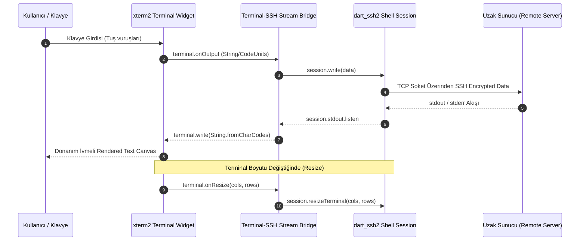

# Terly2 — Teknik Mimari Spesifikasyonu (Technical Specification & Technology Stack)

> **Doküman Amacı:** Terly2 uygulamasının 5 ana platformda (iOS, Android, macOS, Windows, Linux) yüksek performanslı, güvenli, sürdürülebilir ve mimari açıdan kusursuz bir şekilde geliştirilmesi için teknoloji yığını seçimi, kütüphane analizi, yazılım mimarisi, kritik alt sistem tasarımlarını ve kenar durum (edge case) çözümlerini eksiksiz olarak tanımlamak.

---

## 1. Genel Teknoloji Yığını ve Paket Seçim Özeti (Tech Stack Summary)

| Katman / İhtiyaç | Seçilen Teknoloji / Paket | Lisans / Tip | Neden Bu Seçildi? (Seçim Gerekçesi) |
| :--- | :--- | :--- | :--- |
| **Framework & Dili** | **Flutter SDK 3.x+ / Dart 3.x** | BSD-3 | Tek kod tabanından 5 platforma yerel performans ve tutarlı UI donanım ivmeli (Skia/Impeller) rendering. |
| **State Management** | **`flutter_riverpod` (v2.x+) + `riverpod_annotation`** | MIT | `BuildContext` bağımlılığı olmadan async stream'leri (SSH/Socket) yönetebilme, üst düzey tip güvenliği ve kolay test edilebilirlik. |
| **Terminal UI / Render** | **`xterm2`** *(Forked & Maintained `xterm.dart`)* | MIT | Donanım ivmeli (60 FPS) ANSI/VT100 rendering, CJK/Emoji/IME desteği ve UI katmanından bağımsız terminal tamponu (buffer) yönetimi. |
| **SSH & SFTP Engine** | **`dart_ssh2`** | MIT | Pure Dart ile yazıldığı için C/C++ native derleme karmaşası olmadan 5 platformda sıfır bağımlılıkla çalışır. KEX şifreleme yüklerini Dart Isolate'lerine devrederek UI donmalarını engeller. |
| **Yerel PTY Motoru** | **`flutter_pty`** | MIT | macOS, Windows (ConPTY), Linux ve Android üzerinde yerel terminal (Local Shell: zsh/bash/pwsh) başlatabilme. |
| **Yerel Veritabanı** | **`drift` + `sqlite3_flutter_libs`** | MIT | 2026 itibarıyla en güvenilir, sürdürülebilir, tip güvenli ve SQL tabanlı çözümdür. Relational şema yapısı (Host -> Vault -> Tunnel) için mükemmeldir. |
| **Güvenli Şifreleme** | **`flutter_secure_storage`** | MIT | Şifre ve private key'leri iOS/macOS Keychain, Android KeyStore ve Windows Credential Manager'da donanımsal korur. |
| **Zero-Knowledge Crypto**| **`cryptography`** | Apache 2.0 | Pure Dart + OS WebCrypto/CommonCrypto ivmeli AES-256-GCM, Argon2id, Ed25519 şifreleme motoru. |
| **Biyometrik Kilit** | **`local_auth`** | BSD-3 | FaceID, TouchID, Fingerprint ve Windows Hello donanımsal doğrulaması. |
| **Masaüstü Pencere Yönetimi**| **`window_manager`** | MIT | Frameless pencereler, özel başlık çubuğu (titlebar), boyut/konum saklama ve kapatma aksiyonlarını yakalama. |
| **Sistem Tepsi / Tray** | **`tray_manager`** | MIT | Arka planda çalışan SSH oturumlarını gösteren sistem tepsi (tray) ikonu ve hızlı menü. |
| **Küresel Kısayollar** | **`hotkey_manager`** | MIT | Uygulama arka plandayken bile çalışan global klavye kısayolları (ör. `Ctrl+Alt+T` ile terminal açma). |
| **Sürükle-Bırak (SFTP)** | **`desktop_drop`** | MIT | Masaüstü dosya yöneticisinden uygulama içine dosya sürükleyip indirme/yükleme yapma. |
| **Mobil Arka Plan** | **`flutter_background_service`** | MIT | Bağlantının uygulama arka plana atıldığında kopmasını önleyen iOS/Android background service katmanı. |

---

## 2. Derinlemesine Paket Seçim Analizleri ve Alternatif Değerlendirmeleri

### 2.1. Terminal UI Engine: Neden `xterm2`?
- **Değerlendirilen Alternatifler:** `flutter_pty` + `pty`, ham CustomPainter canvas, `xterm.dart` (orijinal).
- **Analiz:** 
  - Orijinal `xterm.dart` reposu son zamanlarda topluluk güncellemelerinde yavaşladığı için, aktif bakımı yapılan `xterm2` forku tercih edilmiştir.
  - `xterm2`, ANSI renk kodlarını, cursor konumlandırmalarını ve VT100 kaçış dizilerini doğrudan Dart belleğinde (Buffer Matrix) işler.
  - `CustomPainter` kullanarak sadece değişen hücreleri render eder. Bu sayede 100.000 satırlık log akışlarında bile belleği şişirmez ve 60 FPS akıcılık sunar.

### 2.2. SSH / SFTP Protokol Engine: Neden `dart_ssh2`? (Pure Dart vs Native C FFI)
- **Değerlendirilen Alternatifler:** `libssh2` (C++ FFI via Native Assets), `dartssh` (eski paket), `NMSSH` / `JSch` wrappers.
- **Analiz:**
  - Native C/C++ bağlayıcıları (`libssh2` FFI) teorik olarak çok yüksek dosya transfer hızları sunabilir. Ancak 5 farklı platform için (macOS arm64/x64, Windows x64, Linux x64/arm64, iOS arm64, Android armeabi-v7a/arm64-v8a/x86_64) NDK, CMake, Xcode cross-compilation zorluğu ve donanımsal ikili (binary) boyutu maliyeti yaratır.
  - `dart_ssh2` tamamen saf Dart (Pure Dart) ile yazılmıştır. Dart 3.x Isolate optimizasyonları sayesinde Key Exchange (KEX) ve AES şifreleme matematiksel işlemlerini ana UI isolate'inden ayırarak (`Isolate.run`) tamamen takılmasız (jank-free) bir deneyim sunar.

### 2.3. Veritabanı Seçimi: Neden `Drift` (SQLite)? (Isar ve Hive Neden Seçilmedi?)
- **Değerlendirilen Alternatifler:** `Isar`, `Hive` / `hive_ce`, `ObjectBox`, `Drift`.
- **Kritik Karar & Analiz:**
  - **Isar:** 2026 itibarıyla ana geliştiricisi tarafından terk edilmiş durumdadır. C++ native kütüphaneleri masaüstü işletim sistemi güncellemelerinde çökme riski taşımaktadır. **Kesinlikle elenmiştir.**
  - **Hive / hive_ce:** Sadece anahtar-değer (Key-Value) saklama için iyidir. Ancak ilişkisel veri (bir Grubun altındaki Host'lar, her Host'un bağlandığı Tünel kuralları, Host'a atanan Identity) sorgulamasında yetersiz kalmaktadır.
  - **Drift (SQLite):** SQL tabanlıdır, tip güvenlidir (compile-time type safety), reaktiftir (Stream tabanlı UI güncellemeleri), versiyon geçişlerini (migration) mükemmel yönetir ve SQLite gibi 40 yıllık endüstri standardı bir motoru kullanır. Masaüstü ve mobilde `sqlite3_flutter_libs` ile %100 stabil çalışır.

### 2.4. State Management: Neden `Riverpod`?
- **Değerlendirilen Alternatifler:** `flutter_bloc`, `provider`, `signals`, `get`.
- **Analiz:**
  - Terminal uygulamalarında SSH soket dinleyicileri (Stream listeners), tünel sunucuları ve arka plan dosya transferleri UI yaşam döngüsünden (`BuildContext`) bağımsız çalışmalıdır.
  - `Riverpod`, `Ref` mekanizması sayesinde context olmadan iş mantığını yönetmeyi sağlar.
  - `AsyncNotifier` ve `@riverpod` code generation ile kod tekrarı engellenir, donma ve bellek sızıntıları önlenir.

---

## 3. Yazılım Mimarisi (Clean Layered Architecture)

Uygulama, katmanların birbirinden tamamen izole edildiği **Clean Architecture** prensiplerine göre yapılandırılacaktır:

```mermaid
graph TD
    subgraph Presentation Layer (UI & State)
        UI_Screens[Screens / Pages]
        UI_Widgets[Custom Widgets & Xterm Canvas]
        Riverpod_Providers[Riverpod Notifiers & AsyncNotifiers]
    end

    subgraph Domain Layer (Business Logic & Contracts)
        UseCases[Use Cases / Interactors]
        Domain_Models[Domain Entities & Interfaces]
        Services_Abstractions[Service Interfaces]
    end

    subgraph Data Layer (Infrastructure & Persistence)
        Drift_DB[Drift SQLite Database]
        Secure_Store[Secure Storage Vault]
        SSH_Client_Impl[dart_ssh2 Socket & Stream Bridge]
        SFTP_Engine[SFTP Transfer Queue Worker]
        Tunnel_Engine[SOCKS5 / Port Forwarding Server]
        Crypto_Engine[Zero-Knowledge Encryption Engine]
    end

    UI_Screens --> Riverpod_Providers
    Riverpod_Providers --> UseCases
    UseCases --> Domain_Models
    UseCases --> Services_Abstractions
    SSH_Client_Impl -.-> Services_Abstractions
    Drift_DB -.-> Services_Abstractions
    Secure_Store -.-> Services_Abstractions
    SFTP_Engine -.-> Services_Abstractions
```

---

## 4. Kritik Alt Sistem Tasarımları (Subsystem Architectures)

---

### 4.1. Terminal & SSH Akış Köprüsü (Stream Bridge Architecture)

Terminal UI katmanı (`xterm2`) ile SSH ağ katmanı (`dart_ssh2`) arasındaki çift yönlü veri akış mimarisi:



---

### 4.2. Port Forwarding Tünel Motoru Mimarisi

Local, Remote ve Dynamic SOCKS5 tünellerinin çalışma prensibi:

- **Local Port Forwarding (`-L`):**
  1. `RawServerSocket.bind('127.0.0.1', localPort)` ile yerel port dinlenir.
  2. Yerel bir istemci (ör. DBeaver) bağlandığında, `SSHClient.forwardLocal(remoteHost, remotePort)` ile SSH kanalı açılır.
  3. Yerel soket akışı ile SSH kanalı akışı çift yönlü `pipe` yapılır.
- **Dynamic SOCKS5 Proxy (`-D`):**
  1. Yerelde bir SOCKS5 proxy sunucusu başlatılır.
  2. İstemciden gelen bağlantı isteklerinin (Target IP:Port) SOCKS5 el sıkışması (handshake) çözülür.
  3. `SSHClient.forwardLocal(targetHost, targetPort)` dinamik olarak çağrılarak trafik tünellenir.

---

### 4.3. Zero-Knowledge E2EE Şifreleme Katmanı

Uygulamanın güvenlik ve şifreleme iş akışı:

1. **Master Password:** Kullanıcı uygulamayı ilk açtığında güçlü bir Master Password belirler.
2. **Key Derivation (KDF):** Master Password, `Argon2id` (Salt + Memory Hardening) algoritmasından geçirilerek 256-bit `Master Encryption Key` türetilir.
3. **Storage:** Master Encryption Key, cihazın donanımsal güvenli alanında saklanır (`flutter_secure_storage`: iOS Keychain / Android KeyStore / Windows Credential Manager).
4. **Encryption:** Drift veritabanındaki hassas alanlar (SSH şifreleri, private key'ler, sunucu erişim bilgileri) kaydedilmeden önce `AES-256-GCM` ile şifrelenir. Buluta senkronize edilen veri **Zero-Knowledge** prensibiyle şifreli kalır.

---

## 5. Veritabanı Şeması (Drift SQLite Schema)

```sql
-- 1. Workspaces
CREATE TABLE workspaces (
    id TEXT PRIMARY KEY,
    name TEXT NOT NULL,
    color_code TEXT,
    created_at INTEGER NOT NULL
);

-- 2. Identities (Credentials & SSH Keys)
CREATE TABLE identities (
    id TEXT PRIMARY KEY,
    workspace_id TEXT NOT NULL REFERENCES workspaces(id) ON DELETE CASCADE,
    title TEXT NOT NULL,
    username TEXT NOT NULL,
    auth_type TEXT NOT NULL, -- 'password', 'key', 'agent'
    password_encrypted TEXT,
    private_key_encrypted TEXT,
    passphrase_encrypted TEXT,
    created_at INTEGER NOT NULL
);

-- 3. Host Groups (Hiyerarşik Klasörler)
CREATE TABLE host_groups (
    id TEXT PRIMARY KEY,
    workspace_id TEXT NOT NULL REFERENCES workspaces(id) ON DELETE CASCADE,
    parent_id TEXT REFERENCES host_groups(id) ON DELETE SET NULL,
    name TEXT NOT NULL,
    color_tag TEXT
);

-- 4. Hosts (Sunucu Listesi)
CREATE TABLE hosts (
    id TEXT PRIMARY KEY,
    workspace_id TEXT NOT NULL REFERENCES workspaces(id) ON DELETE CASCADE,
    group_id TEXT REFERENCES host_groups(id) ON DELETE SET NULL,
    identity_id TEXT REFERENCES identities(id) ON DELETE SET NULL,
    label TEXT NOT NULL,
    hostname TEXT NOT NULL,
    port INTEGER NOT NULL DEFAULT 22,
    protocol TEXT NOT NULL DEFAULT 'ssh', -- 'ssh', 'mosh', 'local', 'serial'
    color_tag TEXT,
    jump_host_id TEXT REFERENCES hosts(id) ON DELETE SET NULL, -- Sıçrama sunucusu (Bastion)
    created_at INTEGER NOT NULL
);

-- 5. Known Hosts (SSH Host Key Verification & Fingerprints)
CREATE TABLE known_hosts (
    id TEXT PRIMARY KEY,
    hostname TEXT NOT NULL,
    port INTEGER NOT NULL,
    key_type TEXT NOT NULL, -- 'ssh-ed25519', 'rsa-sha2-512'
    fingerprint_sha256 TEXT NOT NULL,
    first_seen_at INTEGER NOT NULL
);

-- 6. Port Forwarding Rules
CREATE TABLE port_forward_rules (
    id TEXT PRIMARY KEY,
    host_id TEXT NOT NULL REFERENCES hosts(id) ON DELETE CASCADE,
    type TEXT NOT NULL, -- 'local', 'remote', 'dynamic'
    local_port INTEGER NOT NULL,
    remote_host TEXT,
    remote_port INTEGER,
    auto_start INTEGER NOT NULL DEFAULT 0
);

-- 7. Snippets
CREATE TABLE snippets (
    id TEXT PRIMARY KEY,
    workspace_id TEXT NOT NULL REFERENCES workspaces(id) ON DELETE CASCADE,
    title TEXT NOT NULL,
    code TEXT NOT NULL,
    tags TEXT -- JSON Array of strings
);
```

---

## 6. Kritik Kenar Durumlar, Sistem Kısıtlamaları ve Çözüm Mimarisi (Edge Cases & OS Constraints)

### 6.1. iOS Sandbox Kısıtlaması & Local Shell Stratejisi
- **Kısıtlama:** Apple iOS politikası gereği uygulamalar doğrudan `/bin/sh` veya `/bin/zsh` gibi işletim sistemi subprocess'lerini çalıştıramaz.
- **Mimari Çözüm:**
  - **macOS, Windows, Linux, Android:** `flutter_pty` ile tam yetkili yerel terminal (Local Terminal) desteği sunulacaktır.
  - **iOS:** Kullanıcı yerel sekme açmak istediğinde *“iOS sandbox kısıtlaması nedeniyle yerel kabuk yerine uzaktaki SSH sunucularına veya Mosh bağlantılarına izin verilir”* uyarısı gösterilecek veya isteğe bağlı local loopback SSH bilgilendirmesi yapılacaktır (Termius ve Blink Shell uyumlu standart yaklaşım).

### 6.2. SSH Host Key Verification & Known Hosts (MitM Koruması)
- **Güvenlik Akışı (TOFU - Trust On First Use):**
  1. Sunucuya bağlanırken `SSHClient.onHostKey` callback'i çalışır.
  2. Sunucunun `SHA-256` public key parmak izi hesaplanır.
  3. Parmak izi `known_hosts` veritabanında sorgulanır:
     - **Daha önce kaydedilmiş ve eşleşiyorsa:** Bağlantı güvenle devam eder.
     - **İlk kez bağlanılıyorsa:** Kullanıcıya diyalog ile *"Sunucu Parmak İzi: SHA256:xxx... Bağlantıyı onaylıyor musunuz?"* sorulur ve `known_hosts` tablosuna kaydedilir.
     - **Eşleşmiyorsa (Değişmişse):** Bağlantı **derhal engellenir** ve *"Man-in-the-Middle Riski! Sunucu Anahtarı Değişti!"* uyarısı verilir.

### 6.3. Mobil Arka Plan & Uyku Modu Yönetimi (Background Session Persistence)
- **Sorun:** Cihaz ekranı kapandığında veya uygulama arka plana atıldığında mobil OS (özellikle iOS) TCP soketlerini keser.
- **Çözüm:**
  - `ServerAliveInterval 30` ile periyodik SSH keep-alive ping paketleri gönderilir.
  - `flutter_background_service` ile Android/iOS arka plan işleyicisi (Background Service) aktif tutulur.
  - Kesintili ve zayıf mobil ağlar için **Mosh (Mobile Shell)** bağlantı seçeneği sunulur.

### 6.4. Mobil Klavye "Sticky Key" Durum Makinesi (Extra Key Bar)
- **Sorun:** Dokunmatik mobil klavyede `Ctrl` ve `Alt` tuşları yoktur.
- **Çözüm (State Machine):**
  - Kısayol çubuğundaki `Ctrl` veya `Alt` butonuna basıldığında durum `ACTIVE` (yapışkan) hale geçer (`ctrlState = true`).
  - Kullanıcı klavyeden bir harfe (ör. `c`) bastığında, `Ctrl+C` ASCII kontrol karakteri (`0x03`) üretilip SSH akışına yazılır ve `ctrlState` otomatik `INACTIVE` durumuna sıfırlanır.

### 6.5. Sekme Yaşam Döngüsü & Bellek Temizliği (Memory Leak Prevention)
- **Sorun:** Çok sayıda sekme açıp kapatırken arka planda kalan soketler ve terminal tamponları bellek sızıntısına yol açabilir.
- **Çözüm:** 
  - Riverpod `autoDispose` sağlayıcıları ile sekme kapatıldığı an `SSHClient.close()`, `Socket.destroy()` ve `Terminal.dispose()` zincirleme olarak çağrılarak tüm bellek kaynakları anında serbest bırakılır.

---

## 7. Proje Dizin Yapısı (Project Directory Layout)

Clean Architecture ile uyumlu modüler dizin mimarisi:

```text
terly2/
├── android/
├── ios/
├── macos/
├── windows/
├── linux/
├── docs/
│   ├── features_and_competitor_analysis.md
│   └── tech_spec.md
└── lib/
    ├── main.dart
    ├── app/
    │   ├── app.dart
    │   ├── router/               # go_router declarative routing
    │   └── theme/                # Custom Themes & Fonts (Catppuccin, Nord vb.)
    ├── core/
    │   ├── constants/
    │   ├── crypto/               # Argon2id & AES-256-GCM Encryption Engine
    │   ├── network/              # SSH/SFTP & Socket Isolates
    │   ├── utils/
    │   └── widgets/              # Common UI Components
    ├── features/
    │   ├── terminal/             # Terminal Screen, xterm2, Stream Bridge
    │   │   ├── data/
    │   │   ├── domain/
    │   │   └── presentation/
    │   ├── hosts/                # Host Management & Grouping UI
    │   ├── sftp/                 # Dual-pane SFTP & Transfer Manager
    │   ├── tunnels/              # Port Forwarding Visual GUI
    │   ├── vault/                # Identity & Key Manager
    │   ├── snippets/             # Snippets & Runbooks
    │   └── settings/             # App Settings & Sync
    └── shared/
        ├── database/             # Drift DB tables & DAOs
        └── storage/              # Secure Storage Service
```

---

## 8. Doğrulama, Test ve CI/CD Stratejisi

1. **Unit Testing (`package:test` / `flutter_test`):**
   - Stream Bridge dönüşümleri (CodeUnits / String dönüşümleri).
   - AES-256-GCM / Argon2id şifreleme ve KDF türetim testleri.
   - Dynamic SOCKS5 paket ayrıştırma (handshake) mantığı.
2. **Database Migration Testing:**
   - `drift_dev` schema verifikasyon testleri ile versiyon yükseltmelerinde veri kaybının önlenmesi.
3. **Widget & UI Integration Testing:**
   - Masaüstü ve mobil ekran boyutlarında `LayoutBuilder` uyumluluk testleri.
   - `xterm2` klavye girdi ve kısayol çubuğu widget testleri.

---

## 9. Özet ve Uygulama Adımları

Bu **Tech Spec** dökümanı ile Terly2 projesinin mimari omurgası, paket seçimleri, güvenlik tasarımı ve kritik kenar durum çözümleri eksiksiz şekilde netleştirilmiştir.
